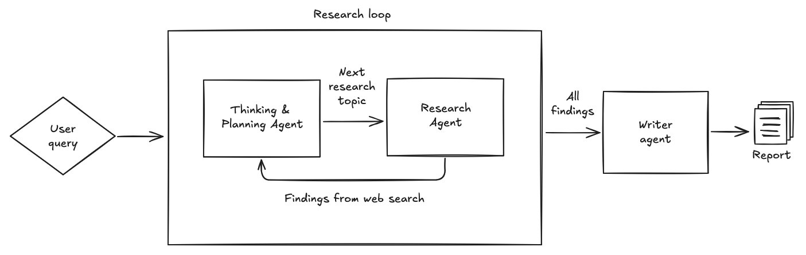

# A simple deep research implementation

This is a simple implementation of a deep research algorithm using the OpenAI Agents SDK.

This is a good starting point for learning purposes, but if you wish to see a more sophisticated and complete implementation you can find that [here](https://github.com/qx-labs/agents-deep-research).

You can read the blog post [here](https://www.j2.gg/thoughts/deep-research-how-it-works) which runs through how deep research works.

## Installation

1. Clone this repository
2. Move into the root directory of this project: `cd code-cookbook/simple-deep-research`
3. Install requirements: `pip install -r requirements.txt`
4. Set up your .env file in the root folder (see `.env-example`) or simply run `export OPENAI_API_KEY=<your_api_key>` in the terminal
4. Run `python -m run`